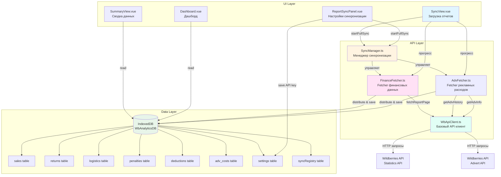
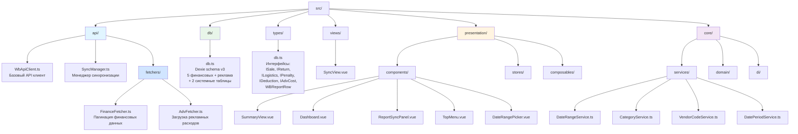
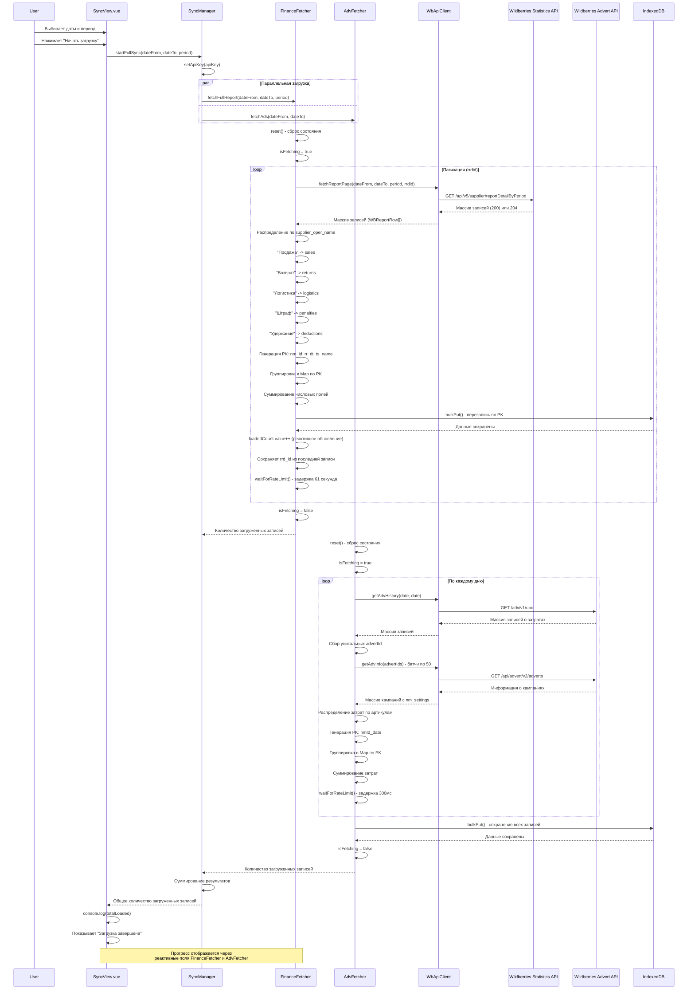
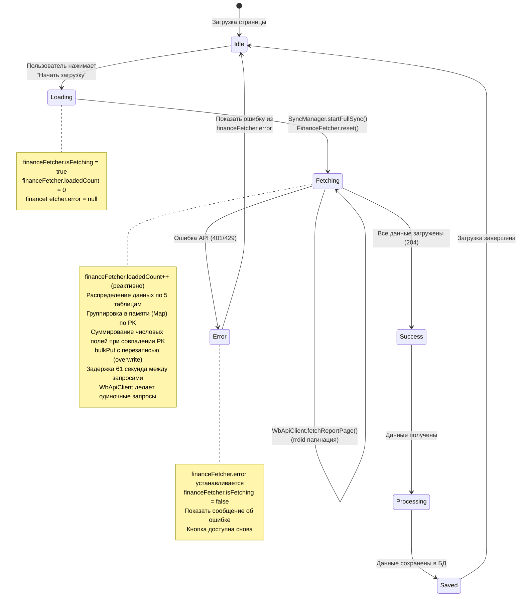
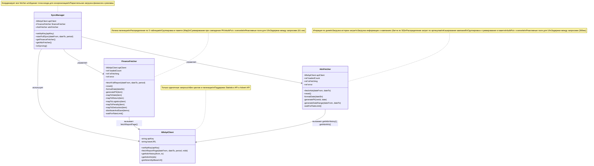

# WB Analytics - Архитектура проекта

## Схема базы данных

```mermaid
erDiagram
    SALES ||--o{ PURCHASE_ORDERS : "связаны"
    RETURNS ||--o{ PURCHASE_ORDERS : "связаны"
    LOGISTICS ||--o{ PURCHASE_ORDERS : "связаны"
    ADV_COSTS ||--o{ SALES : "связаны по артикулу"
    SETTINGS ||--|| SYNC_REGISTRY : "настройки"
    
    SALES {
        string pk PK "nm_id_rr_dt_ts_name"
        string dt "дата"
        number ni "артикул WB"
        string sa "артикул продавца"
        string bc "бренд"
        string sj "предмет"
        string sz "размер"
        number qt "количество"
        number pv "цена продажи"
        number pa "сумма продажи"
        number pz "к выплате"
    }
    
    RETURNS {
        string pk PK "nm_id_rr_dt_ts_name"
        string dt "дата"
        number ni "артикул WB"
        string sa "артикул продавца"
        string bc "бренд"
        string sj "предмет"
        string sz "размер"
        number qt "количество"
        number pv "цена продажи"
        number pa "сумма продажи"
    }
    
    LOGISTICS {
        string pk PK "nm_id_rr_dt_ts_name"
        string dt "дата"
        number ni "артикул WB"
        string sa "артикул продавца"
        string bc "бренд"
        string sj "предмет"
        string sz "размер"
        number dl "доставка"
        number rt "возврат"
        number dr "доставка в рублях"
    }
    
    PENALTIES {
        string pk PK "nm_id_rr_dt_ts_name"
        string dt "дата"
        number ni "артикул WB"
        string sa "артикул продавца"
        string bc "бренд"
        string sj "предмет"
        string sz "размер"
        string bt "тип бонуса"
        number pn "штраф"
    }
    
    DEDUCTIONS {
        string pk PK "nm_id_rr_dt_ts_name"
        string dt "дата"
        number ni "артикул WB"
        string sa "артикул продавца"
        string bc "бренд"
        string sj "предмет"
        string sz "размер"
        string bt "тип бонуса"
        number dd "удержание"
    }
    
    ADV_COSTS {
        string pk PK "nmId_date"
        string dt "дата"
        number ni "артикул WB"
        number costs "сумма рекламных расходов"
    }
    
    SETTINGS {
        string key PK
        string value "значение (API ключ и др.)"
    }
    
    SYNC_REGISTRY {
        string key PK
        any value "значение"
        number updatedAt "дата обновления"
    }
```

## Схема компонентов и потока данных



## Схема структуры директорий



## Схема потока синхронизации данных



## Схема состояния компонентов



## Новая архитектура API слоя



## Логика распределения данных

```mermaid
flowchart TD
    A[WBReportRow из API] --> B{Проверка supplier_oper_name}
    
    B -->|"Продажа"| C[mapToSale]
    B -->|"Возврат"| D[mapToReturn]
    B -->|"Логистика"| E[mapToLogistics]
    B -->|"Штраф"| F[mapToPenalty]
    B -->|"Удержание"| G[mapToDeduction]
    B -->|Другое| H[Пропуск записи]
    
    C --> I[Генерация PK:<br/>nm_id_rr_dt_ts_name]
    D --> I
    E --> I
    F --> I
    G --> I
    
    I --> AG[Группировка в Map по PK]
    
    AG --> J[sales Map]
    AG --> K[returns Map]
    AG --> L[logistics Map]
    AG --> M[penalties Map]
    AG --> N[deductions Map]
    
    J --> SUM1[Суммирование:<br/>qt, pv, pa, pz]
    K --> SUM2[Суммирование:<br/>qt, pv, pa]
    L --> SUM3[Суммирование:<br/>dl, rt, dr]
    M --> SUM4[Суммирование:<br/>pn]
    N --> SUM5[Суммирование:<br/>dd]
    
    SUM1 --> O1[db.sales.bulkPut<br/>(overwrite)]
    SUM2 --> O2[db.returns.bulkPut<br/>(overwrite)]
    SUM3 --> O3[db.logistics.bulkPut<br/>(overwrite)]
    SUM4 --> O4[db.penalties.bulkPut<br/>(overwrite)]
    SUM5 --> O5[db.deductions.bulkPut<br/>(overwrite)]
    
    O1 --> P[IndexedDB сохранено]
    O2 --> P
    O3 --> P
    O4 --> P
    O5 --> P
    
    style C fill:#e1f5ff
    style D fill:#fff4e1
    style E fill:#ffe1f5
    style F fill:#ffe5e1
    style G fill:#f5e1ff
    style I fill:#e8f5e9
    style AG fill:#fff4e1
    style SUM1 fill:#fff9e1
    style SUM2 fill:#fff9e1
    style SUM3 fill:#fff9e1
    style SUM4 fill:#fff9e1
    style SUM5 fill:#fff9e1
    style O1 fill:#e1fff5
    style O2 fill:#e1fff5
    style O3 fill:#e1fff5
    style O4 fill:#e1fff5
    style O5 fill:#e1fff5
    style P fill:#e8f5e9
```

## Маппинг полей из API в таблицы БД

### Финансовые таблицы (из Statistics API)

| supplier_oper_name | Таблица | Поля маппинга |
|-------------------|---------|---------------|
| "Продажа" | `sales` | rr_dt → dt, nm_id → ni, sa_name → sa, brand_name → bc, subject_name → sj, ts_name → sz, quantity → qt, retail_price → pv, retail_amount → pa, ppvz_for_pay → pz |
| "Возврат" | `returns` | rr_dt → dt, nm_id → ni, sa_name → sa, brand_name → bc, subject_name → sj, ts_name → sz, quantity → qt, retail_price → pv, retail_amount → pa |
| "Логистика" | `logistics` | rr_dt → dt, nm_id → ni, sa_name → sa, brand_name → bc, subject_name → sj, ts_name → sz, delivery_amount → dl, return_amount → rt, delivery_rub → dr |
| "Штраф" | `penalties` | rr_dt → dt, nm_id → ni, sa_name → sa, brand_name → bc, subject_name → sj, ts_name → sz, bonus_type_name → bt, penalty → pn |
| "Удержание" | `deductions` | rr_dt → dt, nm_id → ni, sa_name → sa, brand_name → bc, subject_name → sj, ts_name → sz, bonus_type_name → bt, deduction → dd |

**Primary Key (pk) для финансовых таблиц**: `${nm_id}_${rr_dt}_${ts_name}`

### Таблица рекламных расходов (из Advert API)

| Источник данных | Таблица | Поля маппинга |
|----------------|---------|---------------|
| `/adv/v1/upd` (история затрат) + `/api/advert/v2/adverts` (информация о кампаниях) | `adv_costs` | updTime → dt, nm_id (из nm_settings) → ni, updSum / количество артикулов → costs |

**Primary Key (pk) для adv_costs**: `${nmId}_${date}` (артикул_дата)

**Логика распределения затрат**:
1. Получение истории затрат за день через `/adv/v1/upd`
2. Сбор уникальных `advertId` из истории
3. Получение информации о кампаниях через `/api/advert/v2/adverts` (батчи по 50 ID)
4. Извлечение `nm_id` из `nm_settings` каждой кампании
5. Распределение суммы `updSum` на количество артикулов в кампании
6. Группировка по PK (`${nmId}_${date}`) и суммирование затрат

## Логика группировки и перезаписи данных

### Группировка в памяти
Данные группируются в памяти с использованием `Map<string, Record>` перед сохранением в БД:

1. **Генерация PK**: `${nm_id}_${rr_dt}_${ts_name}` (без `rrd_id` для группировки)
2. **Группировка**: Записи с одинаковым PK объединяются в одну запись
3. **Суммирование числовых полей** при совпадении PK:
   - **sales**: `qt`, `pv`, `pa`, `pz`
   - **returns**: `qt`, `pv`, `pa`
   - **logistics**: `dl`, `rt`, `dr`
   - **penalties**: `pn`
   - **deductions**: `dd`

### Перезапись в БД
- `bulkPut()` автоматически заменяет записи с существующими PK (overwrite)
- При повторной загрузке тех же данных (одинаковые даты) старые записи полностью заменяются новыми сгруппированными результатами
- Исключает удвоение сумм при повторных загрузках

## Логика загрузки рекламных расходов

### Процесс загрузки
1. **Итерация по дням**: Генерируется список дат от `dateFrom` до `dateTo`
2. **Для каждого дня**:
   - Получение истории затрат через `getAdvHistory(date, date)`
   - Если затрат нет, переход к следующему дню
   - Сбор уникальных `advertId` из истории затрат
   - Получение информации о кампаниях через `getAdvInfo(advertIds)` (батчи по 50 ID, кэширование)
   - Распределение затрат по артикулам из `nm_settings`
3. **Распределение затрат**:
   - Для каждой записи истории затрат: `costSum / количество_артикулов_в_кампании`
   - Группировка по PK (`${nmId}_${date}`)
   - Суммирование затрат, если один артикул участвовал в нескольких кампаниях за день
4. **Сохранение**: `bulkPut()` всех записей в таблицу `adv_costs`

### Особенности
- **Кэширование кампаний**: Информация о кампаниях кэшируется, чтобы не запрашивать повторно
- **Батчинг**: API ограничивает до 50 ID за запрос, поэтому большие списки разбиваются на батчи
- **Лимиты API**: Задержка 300мс между запросами (1-5 запросов/сек)
- **Логирование**: Подробные логи прогресса в консоль браузера
