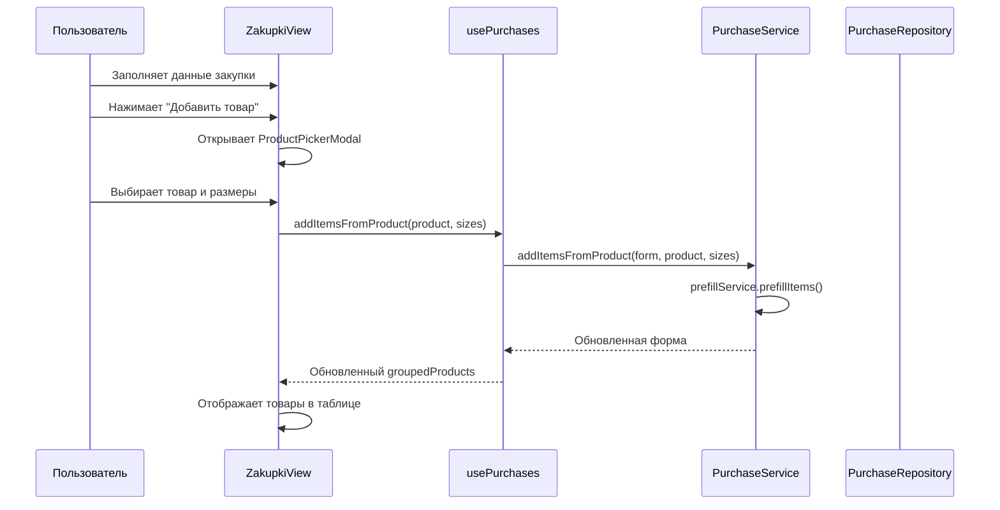
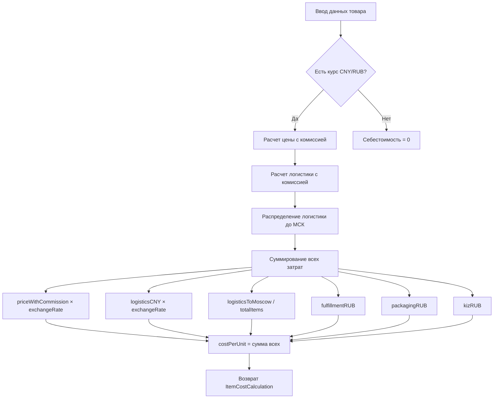
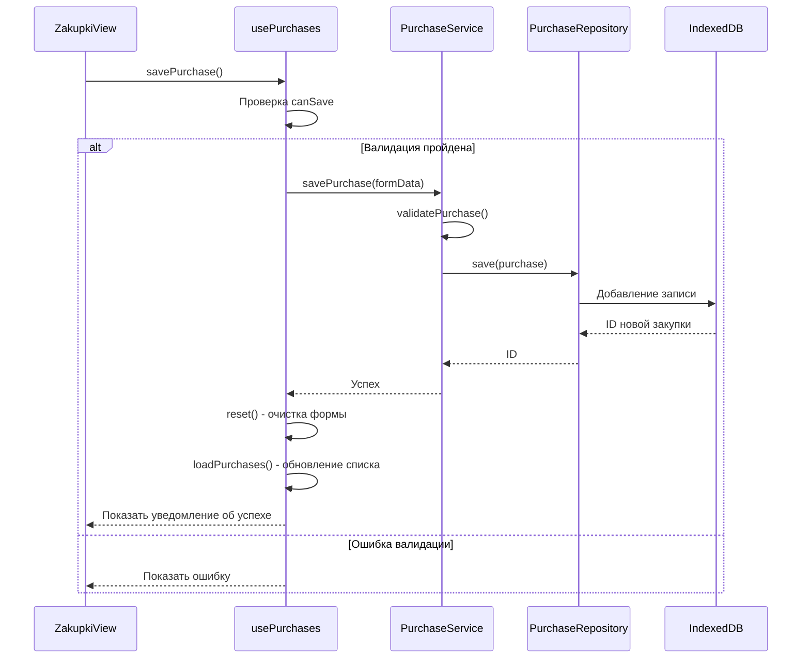

# Система управления закупками из Китая

## 📋 Обзор

Система управления закупками предназначена для учета и расчета себестоимости товаров, закупаемых в Китае для последующей продажи на Wildberries. Система позволяет создавать закупки, добавлять товары с разными размерами, рассчитывать себестоимость с учетом всех расходов и применять данные к поставкам.

---

## 🏗️ Архитектура системы

### Слои архитектуры

```
┌─────────────────────────────────────────────────────────┐
│              Presentation Layer (UI)                     │
│  ┌─────────────────────────────────────────────────┐   │
│  │         ZakupkiView.vue (Vue Component)         │   │
│  │  - Форма создания/редактирования закупки        │   │
│  │  - Таблица товаров с размерами                  │   │
│  │  - Модальное окно выбора товаров                │   │
│  └─────────────────────────────────────────────────┘   │
│  ┌─────────────────────────────────────────────────┐   │
│  │         usePurchases (Vue Composable)           │   │
│  │  - Управление состоянием формы                  │   │
│  │  - Группировка товаров по артикулам             │   │
│  │  - Валидация и обработка событий                │   │
│  └─────────────────────────────────────────────────┘   │
└─────────────────────────────────────────────────────────┘
                           ↓
┌─────────────────────────────────────────────────────────┐
│          Application Layer (Business Logic)              │
│  ┌─────────────────────────────────────────────────┐   │
│  │           PurchaseService                       │   │
│  │  - Оркестрация работы всех сервисов             │   │
│  │  - Валидация закупок                            │   │
│  │  - Группировка товаров по nmID                  │   │
│  └─────────────────────────────────────────────────┘   │
│  ┌─────────────────────────────────────────────────┐   │
│  │        PurchaseCalculator                       │   │
│  │  - Расчет себестоимости единицы товара          │   │
│  │  - Расчет общих показателей закупки             │   │
│  │  - Распределение логистики до Москвы            │   │
│  └─────────────────────────────────────────────────┘   │
│  ┌─────────────────────────────────────────────────┐   │
│  │     ProductCardPrefillService                   │   │
│  │  - Автозаполнение данных товара из каталога     │   │
│  └─────────────────────────────────────────────────┘   │
└─────────────────────────────────────────────────────────┘
                           ↓
┌─────────────────────────────────────────────────────────┐
│            Domain Layer (Interfaces)                     │
│  ┌─────────────────────────────────────────────────┐   │
│  │      IPurchaseRepository                        │   │
│  │      IPurchaseCalculator                        │   │
│  │      IPurchasePrefillService                    │   │
│  └─────────────────────────────────────────────────┘   │
└─────────────────────────────────────────────────────────┘
                           ↓
┌─────────────────────────────────────────────────────────┐
│        Infrastructure Layer (Data Access)                │
│  ┌─────────────────────────────────────────────────┐   │
│  │        PurchaseRepository                       │   │
│  │  - CRUD операции с IndexedDB                    │   │
│  │  - Хранение закупок в локальной БД              │   │
│  └─────────────────────────────────────────────────┘   │
└─────────────────────────────────────────────────────────┘
```

---

## 📊 Структура данных

### IPurchase (Закупка)

Основная сущность закупки из Китая.

```typescript
interface IPurchase {
  id?: number                    // ID закупки (автоинкремент)
  date: string                   // Дата закупки (YYYY-MM-DD)
  orderNumber: string            // Номер заказа
  status: string                 // Статус: 'pending' | 'ordered' | 'shipped' | 'received'
  exchangeRate: number           // Курс CNY к RUB
  buyerCommissionPercent: number // Комиссия байера (%)
  logisticsToMoscow: number      // Общая логистика до Москвы (RUB)
  items: IPurchaseItem[]         // Массив товаров в закупке
}
```

**Статусы закупки:**
- `pending` — Ожидает
- `ordered` — Заказано
- `shipped` — Отправлено
- `received` — Получено

### IPurchaseItem (Товар в закупке)

Представляет единицу товара с определенным размером.

```typescript
interface IPurchaseItem {
  nmID: number          // Артикул WB (идентификатор товара)
  vendorCode: string    // Артикул продавца
  title?: string        // Название товара (только для чтения)
  color?: string        // Цвет товара (только для чтения)
  techSize: string      // Размер товара (S, M, L, XL, 2XL и т.д.)
  weightPerUnit?: number // Вес единицы в кг
  priceCNY: number      // Цена в CNY
  logisticsCNY: number  // Логистика по Китаю в CNY
  fulfillmentRUB: number // Фулфилмент в RUB
  packagingRUB: number  // Упаковка в RUB
  kizRUB: number        // КИЗ в RUB
  quantity: number      // Количество единиц
}
```

### GroupedPurchase (Сгруппированный товар)

Представление товара для UI с группировкой по артикулу (nmID).

```typescript
interface GroupedPurchase {
  nmID: number           // Артикул WB
  title: string          // Название товара
  vendorCode: string     // Артикул продавца
  img: string | null     // URL изображения
  color: string          // Цвет товара
  items: IPurchaseItem[] // Массив размеров этого товара
  totalQuantity: number  // Общее количество по всем размерам
}
```

### PurchaseSummary (Сводка закупки)

Итоговые показатели закупки.

```typescript
interface PurchaseSummary {
  totalWeight: number    // Общий вес партии (кг)
  totalItems: number     // Количество уникальных товаров
  totalQuantity: number  // Общее количество единиц
}
```

### ItemCostCalculation (Расчет себестоимости)

Детальный расчет себестоимости единицы товара.

```typescript
interface ItemCostCalculation {
  costPerUnit: number    // Итоговая себестоимость единицы (RUB)
  breakdown: {           // Детализация по статьям расходов
    priceWithCommission: number   // Цена с комиссией байера (RUB)
    logisticsCNY: number          // Логистика по Китаю (RUB)
    logisticsToMoscow: number     // Логистика до Москвы (RUB)
    fulfillment: number           // Фулфилмент (RUB)
    packaging: number             // Упаковка (RUB)
    kiz: number                   // КИЗ (RUB)
  }
}
```

---

## 🔄 Процессы работы системы

### 1. Создание новой закупки



**Шаги:**
1. Пользователь заполняет основные данные: дата, номер заказа, статус
2. Опционально: задает дополнительные параметры (курс CNY/RUB, комиссия, логистика)
3. Добавляет товары через модальное окно выбора
4. Для каждого товара выбирает нужные размеры
5. Система автоматически подтягивает данные из каталога товаров

### 2. Расчет себестоимости



**Формула расчета себестоимости:**

```
Себестоимость единицы = (
  (Цена CNY × (1 + Комиссия% / 100)) × Курс CNY/RUB +
  (Логистика CNY × (1 + Комиссия% / 100)) × Курс CNY/RUB +
  Логистика до МСК / Общее количество товаров +
  Фулфилмент RUB +
  Упаковка RUB +
  КИЗ RUB
)
```

### 3. Группировка товаров

Товары группируются по артикулу WB (nmID) для удобного отображения:

- **Родительская строка** — общая информация об артикуле:
  - Фото, название, артикул, цвет
  - Общее количество по всем размерам
  - Поля для ввода общих параметров (цена, вес, логистика и т.д.)
  - Кнопка применения цены на все размеры

- **Дочерние строки** — размеры товара:
  - Размер (S, M, L и т.д.)
  - Количество
  - Цена CNY
  - Автоматический расчет себестоимости

### 4. Сохранение закупки



**Валидация перед сохранением:**
- ✅ Дата заполнена
- ✅ Номер заказа заполнен
- ✅ Есть хотя бы один товар
- ✅ У каждого товара указаны: nmID, techSize, quantity > 0

---

## 🎨 Интерфейс пользователя

### Основные компоненты

#### 1. Форма закупки (ZakupkiView.vue)

**Основные поля:**
- **Дата** — календарь выбора даты закупки
- **Номер** — текстовое поле для номера заказа
- **Статус** — выпадающий список (Ожидает/Заказано/Отправлено/Получено)

**Дополнительные параметры** (скрыты по умолчанию):
- **Курс CNY/RUB** — по умолчанию 12.5
- **Комиссия (%)** — по умолчанию 5%
- **Логистика до МСК (₽)** — общие затраты на доставку до Москвы

#### 2. Таблица товаров

**Блок итогов:**
- Общий вес партии (кг)
- Количество товаров
- Общее количество единиц

**Таблица с колонками:**
- Фото
- Название (с кнопкой показать/скрыть размеры)
- Артикул WB
- Цвет
- Размер (в родительской строке показывается "—")
- Кол-во
- Цена CNY
- Вес (кг)
- Лог. CNY
- Фулф. ₽
- Упак. ₽
- КИЗ ₽
- Применить (кнопка применения цены на все размеры)
- Себест. ₽ (автоматический расчет)
- Удалить (кнопка удаления артикула/размера)

**Особенности отображения:**
- Родительская строка имеет серый фон
- Дочерние строки (размеры) свернуты по умолчанию
- Размеры отображаются в одну строку с горизонтальной прокруткой
- Каждый размер в отдельном блоке с полями "Кол-во" и "Цена CNY"

#### 3. Модальное окно выбора товара (ProductPickerModal)

- Поиск товаров по артикулу или названию
- Выбор размеров для каждого товара
- Предпросмотр информации о товаре
- Добавление выбранных товаров в закупку

---

## 🔧 Основные функции

### PurchaseService

**Основные методы:**
- `loadPurchases()` — загрузка всех закупок из БД
- `savePurchase(purchase)` — сохранение новой или обновление существующей закупки
- `deletePurchase(id)` — удаление закупки
- `groupPurchasesByNmID(items, productCards)` — группировка товаров по артикулу
- `addItemsFromProduct(form, product, sizes, productCards)` — добавление товаров в закупку
- `removeGroup(form, nmID)` — удаление группы товаров (всех размеров артикула)
- `removeItem(form, nmID, techSize)` — удаление конкретного размера
- `applyValueToGroup(form, nmID, field, value)` — применение значения ко всем размерам артикула

### PurchaseCalculator

**Методы расчета:**
- `calculateItemCost(item, purchase)` — расчет себестоимости единицы товара
- `calculateTotalWeight(items)` — расчет общего веса партии
- `calculateSummary(purchase)` — расчет сводных показателей закупки
- `distributeLogisticsToMoscow(logisticsToMoscow, items)` — распределение логистики до Москвы

### ProductCardPrefillService

**Методы автозаполнения:**
- `prefillItems(product, sizes, productCards)` — автозаполнение данных товара из каталога
- Подтягивание: название, цвет, изображение, артикул продавца

---

## 💾 Хранение данных

### IndexedDB структура

Закупки хранятся в таблице `purchases` с полями:
- `id` — Primary Key (автоинкремент)
- Все поля из интерфейса `IPurchase`
- JSON сериализация массива `items`

### Индексирование

Индексы для быстрого поиска:
- По дате
- По статусу
- По номеру заказа

---

## 🔗 Интеграция с другими модулями

### Связь с поставками (Supplies)

Закупки можно применять к поставкам через метод `applyToSupply(purchase)`:
- Данные о себестоимости передаются в поставку
- Связь между закупкой и поставкой для отслеживания

### Использование каталога товаров

Система использует `productCards` из `analyticsStore`:
- Получение информации о товарах (название, цвет, фото)
- Валидация артикулов
- Автозаполнение данных при добавлении товара

---

## 📝 Пример использования

### Создание закупки с одним товаром

1. **Заполнение формы:**
   ```
   Дата: 2026-01-07
   Номер: PO-001
   Статус: Ожидает
   Курс CNY/RUB: 12.5
   Комиссия: 5%
   ```

2. **Добавление товара:**
   - Нажать "Добавить товар"
   - Выбрать товар из каталога
   - Выбрать размеры: S, M, L, XL
   - Товар появится в таблице

3. **Заполнение данных:**
   - В родительской строке указать:
     - Цена CNY: 50
     - Вес: 0.2 кг
     - Логистика CNY: 10
   - Нажать "Применить цену на все размеры"
   - Для каждого размера указать количество

4. **Расчет себестоимости:**
   - Система автоматически рассчитывает себестоимость для каждого размера
   - Формула учитывает все расходы

5. **Сохранение:**
   - Нажать "Сохранить закупку"
   - Закупка сохраняется в локальную БД
   - Форма очищается

---

## ⚠️ Важные замечания

1. **Курс валют:** Рекомендуется обновлять курс CNY/RUB перед каждой закупкой
2. **Комиссия байера:** Применяется ко всем ценам и логистике в CNY
3. **Логистика до Москвы:** Распределяется равномерно на все единицы товара в закупке
4. **Валидация:** Все обязательные поля должны быть заполнены перед сохранением
5. **Удаление:** При удалении артикула удаляются все его размеры

---

## 🔄 Потенциальные улучшения

- [ ] Импорт закупок из Excel/CSV
- [ ] Экспорт закупок в Excel
- [ ] История изменений закупок
- [ ] Уведомления о смене статуса
- [ ] Интеграция с внешними системами учета
- [ ] Множественное редактирование размеров
- [ ] Копирование закупки
- [ ] Шаблоны закупок
- [ ] Расчет сроков доставки
- [ ] Привязка к поставщикам

---

## 📚 Связанные документы

- [Архитектура приложения](../ARCHITECTURE.md)
- [Типы данных](../../src/types/db.ts)
- [API поставок](./SUPPLY_SYSTEM.md)

---

*Документ создан: 2026-01-07*  
*Версия системы: 1.0*

